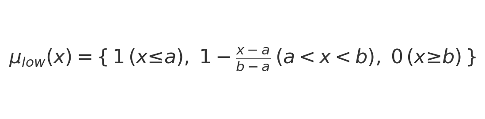
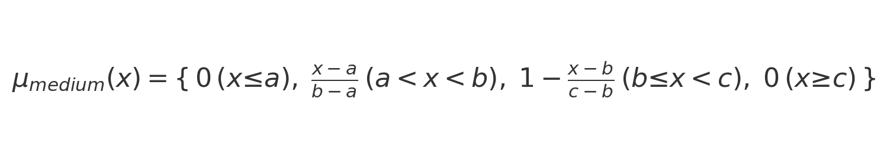
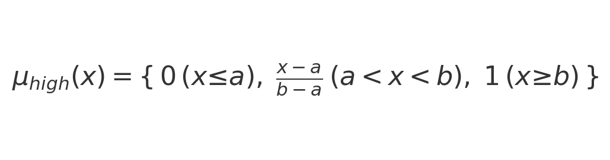

# Proje Raporu: Fuzzy Brake Controller

## 1. Giriş ve Amaç
Araçlarda sürüş güvenliği ve konforu, fren basıncı dağılımının yol koşullarına ve sürüş tarzına dinamik uyumuyla artırılabilir.  
Bu proje, fren basıncı dağılımını ön ve arka tekerlekler arasında bulanık mantık kontrolcüsü kullanarak optimize etmeyi amaçlamaktadır.

## 2. Literatür Taraması
- Bulanık mantık, belirsiz ve sürekli verileri insan benzeri IF–THEN kurallarıyla işleme uygundur.  
- Otomotivde ABS ve ESP sistemlerinde bulanık kontrolcü uygulamaları yaygındır.

### 3. Üyelik Fonksiyonları

Her her girdi değişkeni için üçgen üyelik fonksiyonları:

  
*Düşük (Low)*

  
*Orta (Medium)*

  
*Yüksek (High)*

## 4. Kural Tabanı ve Çıkarım Süreci

### 4.1. Örnek Kural
> **Kural:** Eğer hız **yüksek** **ve** yol tutuş **düşük** ise **arka bias** **yüksek**.

### 4.2. Adım Adım Sayısal Örnek
1. **Girdiler:**  
   \[
     \text{speed}=150,\;
     \text{brake\_pressure}=60,\;
     \text{road\_grip}=30,\;
     \text{slope}=0,\;
     \text{tire\_temp}=50
   \]
2. **Üyelik Değerleri:**  
   \[
     \mu_{speed,high}(150) = \frac{150-120}{200-120}=0.375,\quad
     \mu_{road\_grip,low}(30) = 1 - \frac{30-0}{40-0}=0.25
   \]
3. **Kural Aktive Gücü (α):**  
   \(\alpha = \min(0.375,0.25) = 0.25\)
4. **Çıktı Üyelik Fonksiyonunda Kesme:**  
   Arka bias “high” fonksiyonunda bu seviye kadar kesildi.
5. **Defuzzification (Merkez Ağırlık - Centroid):**  
   \[
     y^* = \frac{\int y\;\mu'(y)\,dy}{\int \mu'(y)\,dy}
   \]
   Hesaplama sonucunda yaklaşık olarak  
   \(\text{front\_bias}\approx60\%,\quad \text{rear\_bias}\approx75\%\)

## 5. Mimari ve Uygulama Detayları
- **`create_brake_controller()`**: scikit-fuzzy ile tüm Antecedent/Consequent’ler, üyelik fonksiyonları ve ~20 kural tanımlanır.  
- **Tkinter UI** (`fuzzy_brake_controller.py`): Slider + anlık etiket + Hesapla butonu.  
- **PyQt5 UI** (`qt_gui.py`): Alternatif kullanıcı dostu arayüz.  

## 6. Test Sonuçları
| Senaryo | Speed (km/h) | Brake % | Grip % | Ön Bias % | Arka Bias % |
|:-------:|:------------:|:-------:|:------:|:---------:|:-----------:|
| 1       | 120          | 80      | 50     | 85.2      | 68.5        |
| 2       | 50           | 30      | 80     | 45.0      | 20.3        |

## 7. Sonuç ve Öneriler
Bu kontrolcü, farklı hız ve yol koşullarında ön/arka fren dağılımını dinamik olarak ayarlayarak hem güvenliği hem de sürüş konforunu artırır.  
**Geliştirme Önerileri:**  
- Gerçek CAN-bus verisiyle kalibrasyon  
- Qt5 arayüzünde grafiksel gösterimler  
- Kural optimizasyonu için makine öğrenimi desteği  

---

*Nevzatcan Çelik | 2025*  
